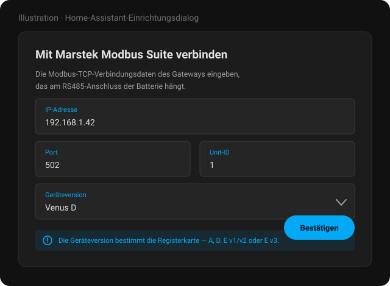

# Marstek Modbus Suite für Home Assistant

**Marstek-Venus-Speicher über lokales Modbus TCP auslesen und steuern — mit eigenem Dashboard.**

Kein Marstek-Konto. Keine Cloud. Kein MQTT-Broker. Kein YAML.

---

## Das Panel

Die Integration bringt ihre eigene Seite mit. Sie erscheint in der Seitenleiste, sobald ein
Speicher eingerichtet ist, und braucht keine nachinstallierten Karten — jedes Element darin gehört
zur Integration.

Der äußere Ring ist die Meldung des BMS, der innere das, was oberhalb der Entladegrenze nutzbar
ist — die Lücke zwischen beiden **ist** die Reserve, gezeigt statt beschrieben.

Der Zellbereich jedes Packs auf **einer gemeinsamen Achse**. Das Gerät meldet ein Delta je Pack,
aber nie eines über den ganzen Stapel — ein Pack auf anderem Niveau als seine Nachbarn ist in den
Zahlen unsichtbar und hier offensichtlich. Es ist der Balken, der zur Seite gewandert ist.

Ladezustand je Pack auf gemeinsamer Skala, mit eingezeichneter Entladegrenze. Packs, die mehr als
fünf Punkte vom **Median** abweichen, werden markiert — Median statt Mittelwert, damit ein einzelner
Ausreißer den Bezugswert nicht zu sich zieht und sich damit selbst versteckt.

Drei weitere Reiter decken **Solar** (die MPPT-Eingänge), **Energie** (Tag, Monat und Gesamtzeit
nebeneinander) und **System** (Gerät, Firmware, Verbindung, Störungen, Grenzwerte) ab.

Das Panel folgt der Hell-/Dunkel-Einstellung von Home Assistant, spricht die dort eingestellte
Sprache und findet seine Entitäten über das dahinterliegende Register — es funktioniert also
unabhängig davon, wie du dein Gerät genannt hast oder in welchem Bereich es liegt.

---

## Was dein Modell kann

Nicht jede Venus hat dieselbe Hardware. Eine Venus E hat einen fest eingebauten Speicher, der sich
nicht erweitern lässt, und keine Solareingänge; A und D nehmen bis zu sechs beziehungsweise sieben
Packs auf und haben MPPT. Das Panel blendet Reiter aus, für die ein Modell keine Daten hat, und die
Entitätsliste folgt denselben Grenzen.

### Messwerte

| | Venus A | Venus D | Venus E v1/v2 | Venus E v3 |
|---|:---:|:---:|:---:|:---:|
| Ladezustand, Leistung, Spannung, Strom | ✅ | ✅ | ✅ | ✅ |
| AC-Seite: Leistung, Spannung, Frequenz | ✅ | ✅ | ✅ | ✅ |
| Notstromausgang | ✅ | ✅ | ✅ | ✅ |
| Energiezähler: Tag, Monat, gesamt | ✅ | ✅ | ✅ | ✅ |
| Roundtrip- und Umwandlungswirkungsgrad | ✅ | ✅ | ✅ | ✅ |
| Nutzbare Energie, Energie bis voll, Laufzeit | ✅ | ✅ | ✅ | ✅ |
| Verbleibende Zyklen und Batteriezustand | ✅ | ✅ | ✅ | ✅ |
| Innen- und Zelltemperaturen | ✅ | ✅ | ✅ | ✅ |
| Firmware-Versionen, Netzwerkdiagnose | ✅ | ✅ | ✅ | ✅ |
| Stör- und Alarmregister | ✅ | ✅ | ✅ | ❌ |
| **Solareingänge (MPPT)** | ✅ | ✅ | ❌ | ❌ |
| **Zellspannungen je Pack** | ✅ | ✅ | ❌ | ❌ |
| **Ladezustand je Pack** | ✅ | ✅ | ❌ | ❌ |
| **Temperaturen und Zyklen je Pack** | ✅ | ✅ | ❌ | ❌ |
| **Schutzflags je Pack** | ✅ | ✅ | ❌ | ❌ |
| Batteriepacks | bis zu 6 | bis zu 7 | 1, fest verbaut | 1, fest verbaut |

### Steuerung

| | Venus A | Venus D | Venus E v1/v2 | Venus E v3 |
|---|:---:|:---:|:---:|:---:|
| Lade- und Entladeleistung | ✅ | ✅ | ✅ | ✅ |
| Leistungsgrenzen | ✅ | ✅ | ✅ | ✅ |
| Ladeziel (SoC-Obergrenze) | ✅ | ✅ | ✅ | ✅ |
| Betriebsmodus, erzwungener Modus | ✅ | ✅ | ✅ | ✅ |
| Sechs Zeitpläne mit Tagesauswahl | ✅ | ✅ | ✅ | ✅ |
| Notstrommodus | ✅ | ✅ | ✅ | ✅ |
| Netzstandard | ❌ | ❌ | ✅ | ❌ |

### Panel-Reiter

| | Venus A | Venus D | Venus E v1/v2 | Venus E v3 |
|---|:---:|:---:|:---:|:---:|
| Übersicht | ✅ | ✅ | ✅ | ✅ |
| Zellen | ✅ | ✅ | ❌ | ❌ |
| Packs | ✅ | ✅ | ❌ | ❌ |
| Solar | ✅ | ✅ | ❌ | ❌ |
| Energie | ✅ | ✅ | ✅ | ✅ |
| System | ✅ | ✅ | ✅ | ✅ |

> [!IMPORTANT]
> Venus **A**, **D** und **E v3** teilen eine Firmware-Basis. Venus **E v1/v2** baut auf einer
> **völlig anderen** auf — ein Registerfund aus A-/D-/E3-Firmware sagt nichts über E v1/v2, wo eine
> übereinstimmende Registernummer Zufall ist, solange sie nicht dort bestätigt wurde.

---

## Warum Modbus

Bluetooth erreicht den Speicher von einem Telefon aus, eines nach dem anderen. Die Cloud erreicht
ihn von überall, aber nur so weit, wie Marsteks App es zulässt, und nur solange deren Dienst läuft.
Modbus ist die Schnittstelle, die immer da ist, in Millisekunden antwortet und von Wechselrichtern,
SPSen und Energiemanagern gleichermaßen gelesen wird — Home Assistant sieht also **dieselben Zahlen
aus derselben Quelle** wie alles andere in deiner Anlage.

---

## Voraussetzungen

- Eine **Modbus-RTU-zu-TCP-Bridge** am RS485-Port des Speichers
  - oder eine **Ethernet-Verbindung** direkt zu einem Speicher, der selbst Modbus TCP spricht
- **IP-Adresse**, **Port** (meist 502) und **Unit ID** (auch Slave ID) dieser Bridge
- Home Assistant **2025.9** oder neuer
- HACS, für die bequeme Installation

### Getestete Gateways

| Gateway | Anmerkung |
|---|---|
| Elfin EW11 | WLAN auf RS485 |
| PUSR DR134 | Modbus-Gateway |
| Waveshare RS485 auf RJ45 | Ethernet-Wandler |
| M5Stack RS485 + Atom S3 Lite | RS485-Modul mit Atom S3 Lite |
| Venus A / D / E v3 über Ethernet | Kein Adapter nötig |

---

## Installation

1. Dieses Repository in HACS unter **Integrationen → Benutzerdefinierte Repositories** hinzufügen
   (Kategorie: Integration)
2. **Marstek Modbus Suite** installieren
3. Home Assistant neu starten
4. Integration über **Einstellungen → Geräte & Dienste** hinzufügen

Trage die Adresse deines Modbus-TCP-Gateways ein, den Port (Standard 502), die Unit ID (Standard 1,
gültig 1–255) und die Geräteversion — `A`, `D`, `E v1/v2` oder `E v3`. Die Geräteversion wählt die
Registerkarte aus und muss deshalb zur tatsächlichen Hardware passen.

> Die Bilder in diesem README sind Illustrationen, keine Fotos einer laufenden Instanz.

---

## Entitäten

Alles landet auf einem Gerät. Erweiterte und diagnostische Entitäten sind **standardmäßig
deaktiviert** — die Registerkarte ist groß, und alles aktiviert auszuliefern würde die zehn Werte
begraben, die die meisten tatsächlich brauchen. Aktiviere in der Entitätsliste, was du benötigst.

Über die reinen Register hinaus leitet die Integration einige Werte ab, die das Gerät selbst nicht
meldet:

| Entität | Bedeutung |
|---|---|
| `usable_energy` | was oberhalb der Entladegrenze liegt |
| `energy_to_full` | was bis zur Ladeobergrenze fehlt |
| `runtime_to_empty` / `runtime_to_full` | Stunden bei aktueller Leistung, jeweils nur in ihrer Richtung |
| `remaining_cycles`, `battery_health` | Verschleiß gegen die Zyklenangabe der Zellen |
| `stored_energy`, `round_trip_efficiency_*` | Energie im Speicher, Wirkungsgrad über drei Zeitebenen |

---

## Konfiguration

### Verbindung

Unter **Optionen → Verbindungseinstellungen**: IP-Adresse, Port und Unit ID des Gateways sowie die
**Wartezeit zwischen Nachrichten** (Standard 80 ms).

Diese Wartezeit gilt für jede Anfrage, ein höherer Wert verlängert also jeden Abfragezyklus
entsprechend: Bei 300 ms dauert ein Zyklus mit 50 Anfragen 15 Sekunden, bei 80 ms vier. Erhöhe sie
nur, wenn ein Gateway beim Standardwert Antworten verliert, und senke sie wieder, sobald die
Verbindung stabil läuft.

### Energiefenster

Unter **Optionen → Energiefenster**: die **Entladegrenze** in Prozent, Standard 12.

Venus A, D und E v3 geben die Entladegrenze nicht über Modbus heraus — was du in der Marstek-App
eingestellt hast, lässt sich also nicht zurücklesen und wird hier eingetragen. Die Einstellung gilt
je Speicher, zwei können sich also unterscheiden. Die obere Grenze liest die Integration aus dem
Gerät, sofern es sie meldet.

Daran messen `usable_energy`, `energy_to_full` und beide Laufzeit-Sensoren, und das Panel zeichnet
sie als Linie quer über die Pack-Säulen.

### Abfrageintervalle

| Klasse | Standard | Umfasst |
|---|---|---|
| **Hohe Priorität** | 10 s | Schnell veränderliche Werte — Leistung, Spannung, Strom, SoC, Zustände |
| **Niedrige Priorität** | 60 s | Träge Werte — Zählerstände, Diagnose, Firmware, Geräteangaben |

Benachbarte fällige Register werden nach Möglichkeit zu einem Blockzugriff zusammengefasst;
scheitert dieser, fallen die betroffenen Entitäten auf Einzelabfragen zurück. Deaktivierte
Entitäten werden übersprungen — außer ein berechneter Sensor hängt an ihnen, dann werden sie
trotzdem abgefragt.

---

## Was lokal bleibt

Die Integration spricht mit deinem Gateway und mit sonst nichts. Kein Marstek-Konto, keine
Telemetrie, keine ausgehende Verbindung außer dem einen TCP-Socket zu der Adresse, die du
konfiguriert hast.

---

## Bekannte Probleme

- **Benutzer-Arbeitsmodus (AI Optimized) wird nicht korrekt zurückgemeldet**
  Wird `User Work Mode` auf `2 (Trade Mode)` gesetzt, erscheint der neue Zustand unter Umständen
  nicht. Die Marstek-App zeigt den richtigen Modus, Home Assistant weiterhin den vorherigen — wegen
  einer Abweichung in der Antwort des Modbus-Registers. Das liegt an der Firmware.

- **Der Speicher verschwindet alle 30 Minuten aus dem Netz**
  Ein paar Sekunden ohne Modbus und ohne Ping, in festem Rhythmus. Das ist die Firmware des Geräts,
  die ihren Netzwerkchip zurücksetzt, wenn sie Marsteks Cloud nicht erreicht — nicht diese
  Integration und nicht dein Netzwerk. Von hier aus lässt es sich nicht verhindern, nur schnell
  überstehen, und genau das tut die Integration seit 1.2.0. Mechanismus und Abhilfe:
  **[FIRMWARE-DROPOUTS.de.md](FIRMWARE-DROPOUTS.de.md)**.

---

## Häufige Fragen

**Brauche ich ein Gateway, oder kann der Speicher selbst Modbus TCP?**
Venus A, D und E v3 lassen sich direkt per Ethernet anschließen und sprechen Modbus TCP ohne
Adapter. Für alles andere brauchst du eine RS485-auf-TCP-Bridge am RS485-Port.

**Kann ich das parallel zu einem anderen Modbus-Client betreiben?**
Die meisten Gateways bedienen einen TCP-Client zur Zeit. Hält bereits ein Wechselrichter oder
Energiemanager die Verbindung, nimm entweder ein Gateway, das multiplext, oder lies den Speicher
über jenes System aus.

**Warum zeigt meine Venus E weniger Reiter?**
Weil sie weniger Sensoren hat. Eine Venus E hat einen fest eingebauten Speicher und keine
MPPT-Eingänge — Zellen, Packs und Solar wären leere Räume. Sie werden ausgeblendet statt leer
angezeigt.

**Kann ich mehrere Speicher nutzen?**
Ja. Lege jeden als eigenen Integrationseintrag an; das Panel bekommt dann eine Auswahl und merkt
sich, welchen du zuletzt angesehen hast. Eine Summenansicht über mehrere Speicher gibt es noch
nicht.

**Funktioniert das zusammen mit venuscontrol?**
Ja, beides ergänzt sich: [venuscontrol](https://github.com/sphings79/venuscontrol) konfiguriert den
Speicher über Bluetooth — unter anderem lassen sich dort die Schnittstellen einschalten, die diese
Integration anschließend über Modbus liest.

**Wird meine Venus E v1/v2 vollständig unterstützt?**
Sie ist definiert, aber dieses Modell läuft auf einer anderen Firmware-Basis, und die
Registerforschung hier stammt von A-/D-/E3-Hardware. Behandle Funde zu E v1/v2 als unbestätigt.

---

## Verwandte Projekte

- 🖥️ **[venuscontrol](https://github.com/sphings79/venuscontrol)** — cloudfreies
  Web-Bluetooth-Bedienpanel für Venus A / D, inklusive OTA-Firmware-Updates
- 📦 **[Marstek-Firmware-Archiv](https://github.com/sphings79/marstek-firmware-archiv)**
- 🛰️ **[Marstek Offline Endpoint](https://github.com/sphings79/Marstek-offline-endpoint)** —
  beantwortet den Telemetrie-Upload lokal, wodurch die 30-Minuten-Aussetzer verschwinden und die
  Daten im Haus bleiben
- 🔬 **[Reverse Engineering der Venus-D-Firmware](https://github.com/sphings79/Marstek-Venus-D-Firmware-Reverse-Engineering)**
- 🌐 **[Weitere Projekte und Tools](https://sphings-dev.de/)**

## Dank

- Upstream-Integration: **[ViperRNMC/marstek_venus_modbus](https://github.com/ViperRNMC/marstek_venus_modbus)**
