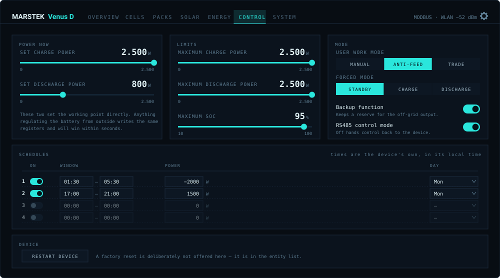
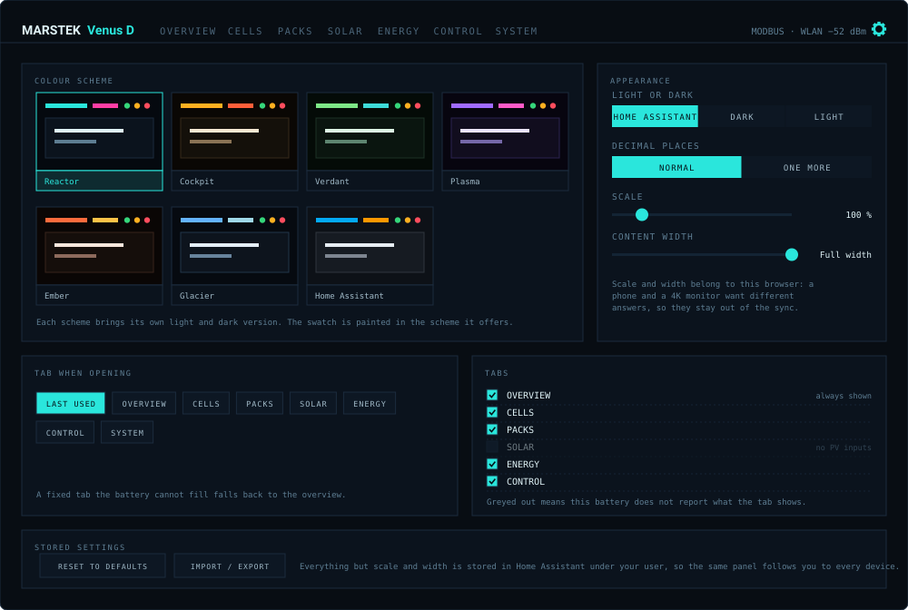

# Marstek Modbus Suite

### Your Marstek Venus, read and driven over local Modbus TCP — with a dashboard of its own.

**No Marstek account · No cloud · No MQTT broker · No YAML**

🇬🇧 English · 🇩🇪 Deutsch · 🇳🇱 Nederlands — [Deutsche Fassung dieser Seite](README.de.md)

|  |  |  |
|:--|:--|:--|
| 🔌 **Local only** | one TCP socket, nothing leaves the house | |
| 📊 **Its own panel** | seven tabs, no custom cards to install | |
| 🎛️ **Writes, not just reads** | power, limits, modes, six schedules | |
| 🔬 **Per pack, per cell** | 112 cell voltages on one shared axis | |
| 🎨 **Seven colour schemes** | light and dark, yours to pick | |
| 🌍 **Three languages** | and it follows Home Assistant | |

---

## The panel

The integration brings its own page. It appears in the sidebar as soon as a battery is set up, and
it needs no custom cards installed — every element in it ships with the integration.

### Overview

The outer ring is what the BMS reports, the inner one what is usable above the discharge floor —
so the gap between them **is** the reserve, shown rather than described.

Two of the four cells beneath it follow the direction of flow: charging shows what still fits and
how long until full, discharging what can still come out and how long until empty. Only one of the
two runtime figures is ever counting, and a fixed slot would show a stopped countdown half the time.

### Cells

Every pack's cell range on **one shared axis**. A battery reports a delta per pack but never one
across the stack, so a pack drifting inside itself is a number among many — and obvious here. It is
the bar that has grown wide.

The spread *across* the stack is reported without a verdict on purpose: the device works one pack at
a time, so the packs sit at different levels and their cells follow. That says nothing about cell
health. The delta **within** a pack does.

### Packs

State of charge per pack on a common scale, with two lines drawn in: the discharge floor, and below
it the limit the **backup socket** reaches during an outage. The pack marked in accent is the one
carrying the current right now — the device works one at a time.

### Control

Charge and discharge power, the limits, work and forced mode, the backup and RS485 switches, and
all six schedules — times, power, day, on and off.

Every control reads its own bounds from the entity rather than hard-coding them, so the same editor
is correct on a **1500 W** Venus A and a **2500 W** Venus D. Times are converted between the HHMM
the registers hold and a clock field.

> [!NOTE]
> Anything that regulates the battery from outside — a zero-feed-in automation, an energy manager —
> writes the same registers and will win within seconds. When that happens right after you set a
> value, the tab says so instead of looking broken.

### Settings

Seven colour schemes, each with its own light and dark version — including one that takes its
colours from your Home Assistant theme. Plus a light/dark override, which tab the panel opens on,
which tabs to hide, an extra decimal place, and two sliders for how large the panel draws and how
wide it runs.

All of it except those two sliders is stored in Home Assistant under your own user, so the panel
looks the same on your phone as on your desk, and the person next to you keeps their own choices.
Scale and width stay in the browser you set them in — a phone and a 4K monitor want different
answers — which is also why the import/export box leaves them out.

Tabs your battery cannot fill are listed greyed out with the reason, so a tab you hid stays
distinguishable from one that was never there.

---

## Languages

| | Config flow and options | Entity names | The panel |
|---|:---:|:---:|:---:|
| 🇬🇧 **English** | ✅ | ✅ | ✅ |
| 🇩🇪 **Deutsch** | ✅ | ✅ | ✅ |
| 🇳🇱 **Nederlands** | ✅ | ✅ | falls back to English |

All three follow whatever language Home Assistant is set to — nothing to configure. Entity names
come from Home Assistant's own translation system, which is also why the panel finds its values by
the **register** behind an entity rather than by its name: rename a device, move it to another area,
switch language, and the panel keeps working.

Another language is a pull request with one file. `custom_components/marstek_modbus/translations/`
holds the entity names, `frontend/src/locales/` the panel's own text.

---

## What your model can do

Not every Venus has the same hardware. A Venus E has one built-in battery that cannot be extended,
and no solar inputs; A and D take up to six or seven packs and carry MPPT. The panel hides the tabs
a model has no data for, and the entity list follows the same lines.

### Readings

| | Venus A | Venus D | Venus E v1/v2 | Venus E v3 |
|---|:---:|:---:|:---:|:---:|
| State of charge, power, voltage, current | ✅ | ✅ | ✅ | ✅ |
| AC side: power, voltage, frequency | ✅ | ✅ | ✅ | ✅ |
| Off-grid output | ✅ | ✅ | ✅ | ✅ |
| Energy counters: day, month, lifetime | ✅ | ✅ | ✅ | ✅ |
| Round-trip and conversion efficiency | ✅ | ✅ | ✅ | ✅ |
| Usable energy, energy to full, runtime | ✅ | ✅ | ✅ | ✅ |
| **Backup reserve** — energy only the off-grid socket reaches | ✅ | ✅ | ❌ | ❌ |
| Remaining cycles and state of health | ✅ | ✅ | ✅ | ✅ |
| Internal and cell temperatures | ✅ | ✅ | ✅ | ✅ |
| Firmware versions, network diagnostics | ✅ | ✅ | ✅ | ✅ |
| Fault and alarm registers | ✅ | ✅ | ✅ | ❌ |
| **Solar inputs (MPPT)** | ✅ | ✅ | ❌ | ❌ |
| **Cell voltages per pack** | ✅ | ✅ | ❌ | ❌ |
| **State of charge per pack** | ✅ | ✅ | ❌ | ❌ |
| **Temperatures and cycles per pack** | ✅ | ✅ | ❌ | ❌ |
| **Protection flags per pack** | ✅ | ✅ | ❌ | ❌ |
| **Which pack is carrying the current** | ✅ | ✅ | ❌ | ❌ |
| Battery packs | up to 6 | up to 7 | 1, built in | 1, built in |

### Control

| | Venus A | Venus D | Venus E v1/v2 | Venus E v3 |
|---|:---:|:---:|:---:|:---:|
| Charge and discharge power | ✅ | ✅ | ✅ | ✅ |
| Power limits | 1500 W | 2500 W | 2500 W | 2500 W |
| Charge target (SoC ceiling) | ✅ | ✅ | ✅ | ✅ |
| Operating mode, forced mode | ✅ | ✅ | ✅ | ✅ |
| Six schedules with day selection | ✅ | ✅ | ✅ | ✅ |
| Backup mode | ✅ | ✅ | ✅ | ✅ |
| RS485 control mode | ✅ | ✅ | ✅ | ✅ |
| Restart the device | ✅ | ✅ | ✅ | ✅ |
| Grid standard | ❌ | ❌ | ✅ | ❌ |

Everything in this table is editable from the **Control** tab as well as from the entity list.

### Panel tabs

| | Venus A | Venus D | Venus E v1/v2 | Venus E v3 |
|---|:---:|:---:|:---:|:---:|
| Overview | ✅ | ✅ | ✅ | ✅ |
| Cells | ✅ | ✅ | ❌ | ❌ |
| Packs | ✅ | ✅ | ❌ | ❌ |
| Solar | ✅ | ✅ | ❌ | ❌ |
| Energy | ✅ | ✅ | ✅ | ✅ |
| **Control** | ✅ | ✅ | ✅ | ✅ |
| System | ✅ | ✅ | ✅ | ✅ |
| **Settings** (the gear) | ✅ | ✅ | ✅ | ✅ |

A tab appears only when the battery has something to put in it, and it can be hidden by hand in
the settings — where the ones your model cannot fill are listed greyed out with the reason.

> [!IMPORTANT]
> Venus **A**, **D** and **E v3** share one firmware base. Venus **E v1/v2** is built on a
> **completely different** one — a register finding from A/D/E3 firmware says nothing about
> E v1/v2, where a matching register number is coincidence until proven otherwise.

---

## Why Modbus

Bluetooth reaches the battery from one phone at a time. The cloud reaches it from anywhere, but
only as far as Marstek's app allows, and only while their service is up. Modbus is the interface
that is always there, answers in milliseconds, and is read by inverters, PLCs and energy managers
alike — so Home Assistant sees **the same numbers from the same source** as everything else in
your setup.

---

## Requirements

- A **Modbus RTU-to-TCP bridge** on the battery's RS485 port
  - or an **Ethernet connection** straight to a battery that speaks Modbus TCP itself
- The **IP address**, **port** (usually 502) and **Unit ID** (also called Slave ID) of that bridge
- Home Assistant **2025.9** or newer
- HACS, for convenient installation

### Tested gateways

| Gateway | Notes |
|---|---|
| Elfin EW11 | WiFi to RS485 |
| PUSR DR134 | Modbus gateway |
| Waveshare RS485 to RJ45 | Ethernet converter |
| M5Stack RS485 + Atom S3 Lite | RS485 module with an Atom S3 Lite |
| Venus A / D / E v3 over Ethernet | No adapter needed |

---

## Installation

1. Add this repository to HACS under **Integrations → Custom repositories** (category: Integration)
2. Install **Marstek Modbus Suite**
3. Restart Home Assistant
4. Add the integration via **Settings → Devices & Services**

Enter the address of your Modbus TCP gateway, the port (default 502), the Unit ID (default 1, valid
range 1–255) and the device version — `A`, `D`, `E v1/v2` or `E v3`. The device version picks the
register map, so it has to match the actual hardware.

The second step asks for the **device name**, prefilled to match the device version you picked. The
name does more than label the device: it is the first half of every entity id
(`sensor.marstek_venus_e_battery_soc`). It is only applied once — renaming later changes the
displayed name, not the entity ids. Two batteries need two different names; the integration rejects
one that is already taken.

### Migrating from Marstek Venus Modbus

This integration is a fork of
[ViperRNMC/marstek_venus_modbus](https://github.com/ViperRNMC/marstek_venus_modbus) and ships in the
same `custom_components/marstek_modbus` folder. The two cannot be installed side by side, so the old
repository has to be removed from HACS first. For the entities there are two paths:

- **Keep the config entry** (recommended): swap the HACS repository only and leave the entry under
  *Devices & Services* alone. Nothing changes — device name, entity ids and history all survive,
  because the entities hang off the unchanged entry id. This integration knows every register key
  the old one had; it only adds more.
- **Entry already deleted**: when setting it up again, enter the name the old entry carried — by
  default `Marstek Venus Modbus`. Both integrations use the same entity names, so the entity ids
  come out exactly as before and dashboards and automations keep working.

> [!NOTE]
> The images in this README are drawings, not photographs of a running instance. To see the real
> panel with the same readings, serve the repository and open
> [`assets/preview/`](assets/preview/) — `python3 -m http.server 8899`, then
> `http://127.0.0.1:8899/assets/preview/?tab=control`.

---

## Entities

Everything lands on one device. **Every entity the panel reads is enabled by default**, so the
panel is complete the moment the integration is set up — nothing to switch on by hand. What stays
disabled is what no view asks for: registers whose meaning is unclear, values a sensor already
reports under another name, and diagnostics for cases that are not yours. Enable those in the
entity list if you want them.

Beyond the raw registers, the integration derives a few values the battery does not report itself:

| Entity | What it is |
|---|---|
| `usable_energy` | what sits above the discharge floor |
| `energy_to_full` | what is missing before the charge ceiling |
| `runtime_to_empty` / `runtime_to_full` | hours at the current power, counting only in that direction |
| `remaining_cycles`, `battery_health` | wear against the cell rating |
| `backup_reserve_energy` | what sits below the floor, reachable only through the off-grid socket (A and D) |
| `stored_energy`, `round_trip_efficiency_*` | energy in the pack, efficiency over three timescales |

---

## Configuration

### Connection

Under **Options → Connection settings**: IP address, port and Unit ID of the gateway, plus the
**wait between messages** (default 80 ms).

That wait applies to every request, so raising it lengthens every poll cycle in proportion: at
300 ms a cycle of 50 requests takes 15 seconds where 80 ms would take 4. Raise it only when a
gateway drops responses at the default, and lower it again once the connection is stable.

### Energy window

Under **Options → Energy window**: the **discharge floor** in percent, default 12.

Venus A, D and E v3 do not expose the discharge limit over Modbus, so whatever you set in the
Marstek app cannot be read back — enter it here instead. It is set per battery, so two of them can
differ. The upper end is read from the device where it reports one.

This is what `usable_energy`, `energy_to_full` and both runtime sensors measure against, and what
the panel draws as a line across the pack columns.

### Polling

| Class | Default | Covers |
|---|---|---|
| **High priority** | 10 s | Fast-changing values — power, voltage, current, SoC, state entities |
| **Low priority** | 60 s | Slow-changing values — totals, diagnostics, firmware, device information |

Adjacent due registers are combined into a single block read where possible; if a block read fails,
the affected entities fall back to individual reads. Disabled entities are skipped — unless a
calculated sensor depends on them, in which case they are polled anyway.

---

## What stays local

The integration talks to your gateway and to nothing else. No Marstek account, no telemetry, no
outbound connection beyond the one TCP socket to the address you configured.

---

## Known issues

- **User Work Mode (AI Optimized) not reflected correctly**
  Setting `User Work Mode` to `2 (Trade Mode)` may not show the updated state. The Marstek app
  shows the correct mode while Home Assistant keeps displaying the previous one, because of a
  discrepancy in the Modbus register response. This is a firmware-side issue.

- **The battery disappears from the network every 30 minutes**
  A few seconds with no Modbus and no ping, on a fixed rhythm. This is the device's own firmware
  resetting its network chip when it cannot reach Marstek's cloud — not this integration, and not
  your network. It cannot be prevented from here, only survived quickly, which is what 1.2.0
  onwards does. Mechanism, and how to stop it: **[FIRMWARE-DROPOUTS.md](FIRMWARE-DROPOUTS.md)**.

---

## FAQ

**Do I need a gateway, or can the battery do Modbus TCP itself?**
Venus A, D and E v3 can be wired straight to Ethernet and speak Modbus TCP without an adapter. For
everything else you need an RS485-to-TCP bridge on the battery's RS485 port.

**Can I run this alongside another Modbus client?**
Most gateways serve one TCP client at a time. If an inverter or energy manager already holds the
connection, either use a gateway that multiplexes, or read the battery through that other system.

**Why does my Venus E show fewer tabs?**
Because it has fewer sensors. A Venus E has one built-in battery and no MPPT inputs, so Cells,
Packs and Solar would open onto empty rooms. They are hidden rather than shown empty.

**Can I use more than one battery?**
Yes. Add each one as its own integration entry; the panel gets a picker and remembers which one you
were looking at. There is no combined view across several batteries yet.

**Can this work together with venuscontrol?**
Yes, and they complement each other:
[venuscontrol](https://github.com/sphings79/venuscontrol) configures the battery over Bluetooth —
including switching on the interfaces this integration then reads over Modbus.

**Is my Venus E v1/v2 fully supported?**
It is defined, but that model runs a different firmware base, and the register research here comes
from A/D/E3 hardware. Treat E v1/v2 findings as unverified.

---

## Related projects

- 🖥️ **[venuscontrol](https://github.com/sphings79/venuscontrol)** — cloud-free Web Bluetooth control
  panel for Venus A / D, including OTA firmware updates
- 📦 **[Marstek firmware archive](https://github.com/sphings79/marstek-firmware-archiv)**
- 🛰️ **[Marstek Offline Endpoint](https://github.com/sphings79/Marstek-offline-endpoint)** — answers the
  telemetry upload locally, which stops the 30-minute network dropouts and keeps your data at home
- 🔬 **[Venus D firmware reverse engineering](https://github.com/sphings79/Marstek-Venus-D-Firmware-Reverse-Engineering)**
- 🌐 **[More projects and tools](https://sphings-dev.de/)**

## Credits

- Upstream integration: **[ViperRNMC/marstek_venus_modbus](https://github.com/ViperRNMC/marstek_venus_modbus)**
