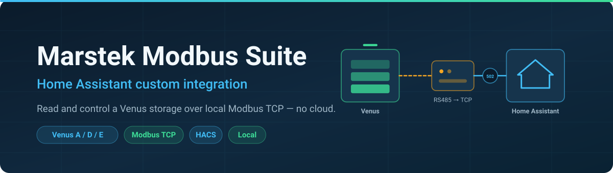
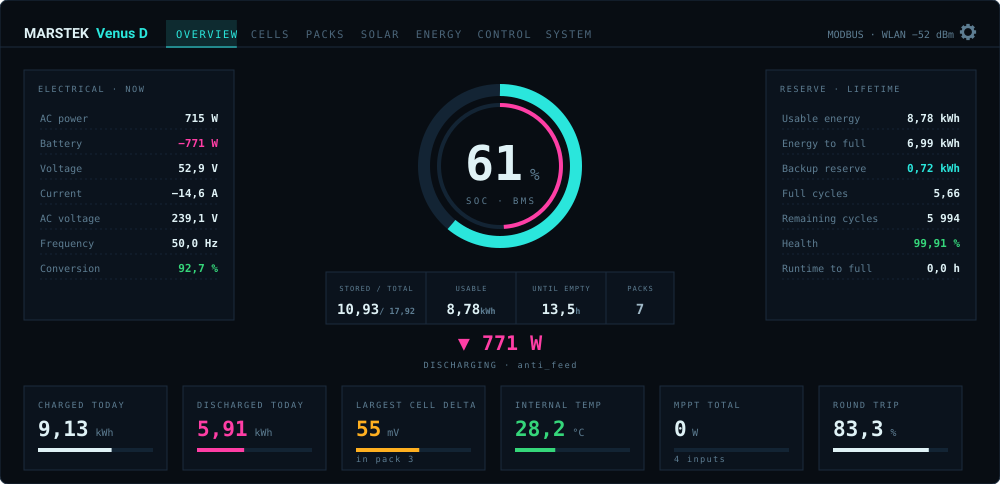
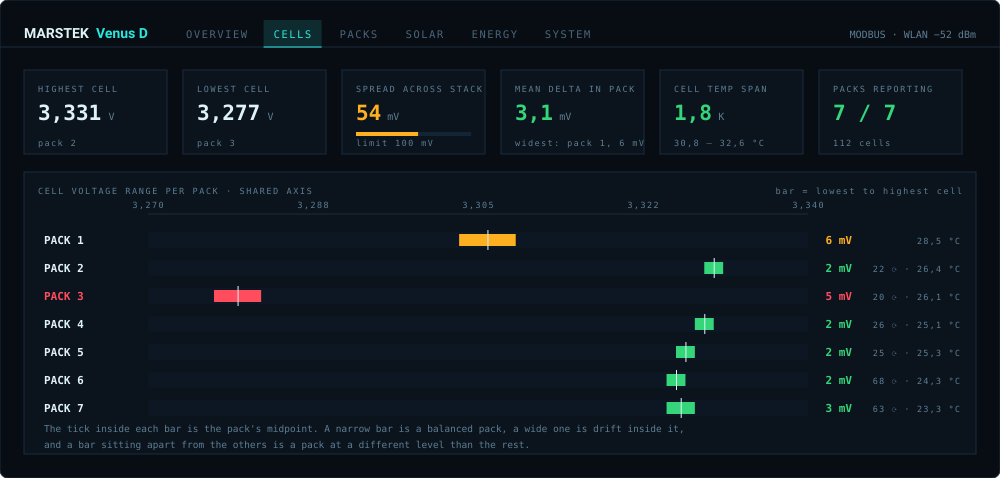
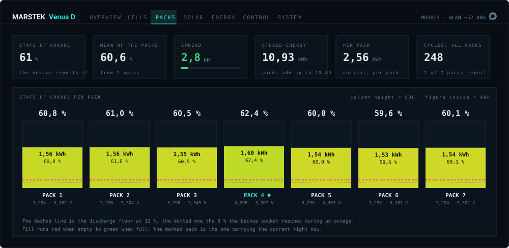
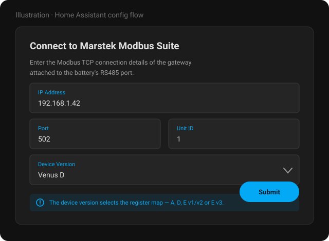
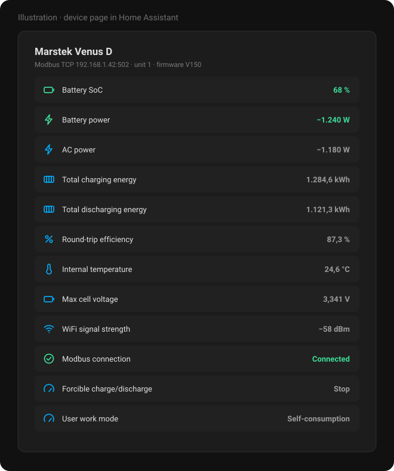

# Marstek Modbus Suite for Home Assistant

**Read and control a Marstek Venus battery over local Modbus TCP — with a dashboard of its own.**

No Marstek account. No cloud. No MQTT broker. No YAML.

---

## The panel

The integration brings its own page. It appears in the sidebar as soon as a battery is set up, and
it needs no custom cards installed — every element in it ships with the integration.

The outer ring is what the BMS reports, the inner one what is usable above the discharge floor —
so the gap between them **is** the reserve, shown rather than described.

Every pack's cell range on **one shared axis**. A battery reports a delta per pack but never one
across the stack, so a pack sitting at a different level than its neighbours is invisible in the
numbers — and obvious here. It is the bar that has drifted sideways.

State of charge per pack on a common scale, with the discharge floor drawn in. Packs more than five
points from the **median** are flagged — the median, not the average, so a single outlier cannot
drag the reference towards itself and hide the fact that it is one.

Three more tabs cover **Solar** (the MPPT inputs), **Energy** (day, month and lifetime side by side)
and **System** (device, firmware, connection, faults, limits).

The panel follows Home Assistant's light and dark setting, speaks the language Home Assistant is
set to, and finds its entities by the register behind them — so it works no matter what you called
your device or which area it sits in.

---

## What your model can do

Not every Venus has the same hardware. A Venus E has one built-in battery that cannot be extended,
and no solar inputs; A and D take up to six or seven packs and carry MPPT. The panel hides the tabs
a model has no data for, and the entity list follows the same lines.

### Readings

| | Venus A | Venus D | Venus E v1/v2 | Venus E v3 |
|---|:---:|:---:|:---:|:---:|
| State of charge, power, voltage, current | ✅ | ✅ | ✅ | ✅ |
| AC side: power, voltage, frequency | ✅ | ✅ | ✅ | ✅ |
| Off-grid output | ✅ | ✅ | ✅ | ✅ |
| Energy counters: day, month, lifetime | ✅ | ✅ | ✅ | ✅ |
| Round-trip and conversion efficiency | ✅ | ✅ | ✅ | ✅ |
| Usable energy, energy to full, runtime | ✅ | ✅ | ✅ | ✅ |
| Remaining cycles and state of health | ✅ | ✅ | ✅ | ✅ |
| Internal and cell temperatures | ✅ | ✅ | ✅ | ✅ |
| Firmware versions, network diagnostics | ✅ | ✅ | ✅ | ✅ |
| Fault and alarm registers | ✅ | ✅ | ✅ | ❌ |
| **Solar inputs (MPPT)** | ✅ | ✅ | ❌ | ❌ |
| **Cell voltages per pack** | ✅ | ✅ | ❌ | ❌ |
| **State of charge per pack** | ✅ | ✅ | ❌ | ❌ |
| **Temperatures and cycles per pack** | ✅ | ✅ | ❌ | ❌ |
| **Protection flags per pack** | ✅ | ✅ | ❌ | ❌ |
| Battery packs | up to 6 | up to 7 | 1, built in | 1, built in |

### Control

| | Venus A | Venus D | Venus E v1/v2 | Venus E v3 |
|---|:---:|:---:|:---:|:---:|
| Charge and discharge power | ✅ | ✅ | ✅ | ✅ |
| Power limits | ✅ | ✅ | ✅ | ✅ |
| Charge target (SoC ceiling) | ✅ | ✅ | ✅ | ✅ |
| Operating mode, forced mode | ✅ | ✅ | ✅ | ✅ |
| Six schedules with day selection | ✅ | ✅ | ✅ | ✅ |
| Backup mode | ✅ | ✅ | ✅ | ✅ |
| Grid standard | ❌ | ❌ | ✅ | ❌ |

### Panel tabs

| | Venus A | Venus D | Venus E v1/v2 | Venus E v3 |
|---|:---:|:---:|:---:|:---:|
| Overview | ✅ | ✅ | ✅ | ✅ |
| Cells | ✅ | ✅ | ❌ | ❌ |
| Packs | ✅ | ✅ | ❌ | ❌ |
| Solar | ✅ | ✅ | ❌ | ❌ |
| Energy | ✅ | ✅ | ✅ | ✅ |
| System | ✅ | ✅ | ✅ | ✅ |

> [!IMPORTANT]
> Venus **A**, **D** and **E v3** share one firmware base. Venus **E v1/v2** is built on a
> **completely different** one — a register finding from A/D/E3 firmware says nothing about
> E v1/v2, where a matching register number is coincidence until proven otherwise.

---

## Why Modbus

Bluetooth reaches the battery from one phone at a time. The cloud reaches it from anywhere, but
only as far as Marstek's app allows, and only while their service is up. Modbus is the interface
that is always there, answers in milliseconds, and is read by inverters, PLCs and energy managers
alike — so Home Assistant sees **the same numbers from the same source** as everything else in
your setup.

---

## Requirements

- A **Modbus RTU-to-TCP bridge** on the battery's RS485 port
  - or an **Ethernet connection** straight to a battery that speaks Modbus TCP itself
- The **IP address**, **port** (usually 502) and **Unit ID** (also called Slave ID) of that bridge
- Home Assistant **2025.9** or newer
- HACS, for convenient installation

### Tested gateways

| Gateway | Notes |
|---|---|
| Elfin EW11 | WiFi to RS485 |
| PUSR DR134 | Modbus gateway |
| Waveshare RS485 to RJ45 | Ethernet converter |
| M5Stack RS485 + Atom S3 Lite | RS485 module with an Atom S3 Lite |
| Venus A / D / E v3 over Ethernet | No adapter needed |

---

## Installation

1. Add this repository to HACS under **Integrations → Custom repositories** (category: Integration)
2. Install **Marstek Modbus Suite**
3. Restart Home Assistant
4. Add the integration via **Settings → Devices & Services**

Enter the address of your Modbus TCP gateway, the port (default 502), the Unit ID (default 1, valid
range 1–255) and the device version — `A`, `D`, `E v1/v2` or `E v3`. The device version picks the
register map, so it has to match the actual hardware.

> The images in this README are illustrations, not photographs of a running instance.

---

## Entities

Everything lands on one device. Advanced and diagnostic entities ship **disabled by default** —
the register map is large, and shipping all of it enabled would bury the ten values most people
actually want. Enable what you need in the entity list.

Beyond the raw registers, the integration derives a few values the battery does not report itself:

| Entity | What it is |
|---|---|
| `usable_energy` | what sits above the discharge floor |
| `energy_to_full` | what is missing before the charge ceiling |
| `runtime_to_empty` / `runtime_to_full` | hours at the current power, counting only in that direction |
| `remaining_cycles`, `battery_health` | wear against the cell rating |
| `stored_energy`, `round_trip_efficiency_*` | energy in the pack, efficiency over three timescales |

---

## Configuration

### Connection

Under **Options → Connection settings**: IP address, port and Unit ID of the gateway, plus the
**wait between messages** (default 80 ms).

That wait applies to every request, so raising it lengthens every poll cycle in proportion: at
300 ms a cycle of 50 requests takes 15 seconds where 80 ms would take 4. Raise it only when a
gateway drops responses at the default, and lower it again once the connection is stable.

### Energy window

Under **Options → Energy window**: the **discharge floor** in percent, default 12.

Venus A, D and E v3 do not expose the discharge limit over Modbus, so whatever you set in the
Marstek app cannot be read back — enter it here instead. It is set per battery, so two of them can
differ. The upper end is read from the device where it reports one.

This is what `usable_energy`, `energy_to_full` and both runtime sensors measure against, and what
the panel draws as a line across the pack columns.

### Polling

| Class | Default | Covers |
|---|---|---|
| **High priority** | 10 s | Fast-changing values — power, voltage, current, SoC, state entities |
| **Low priority** | 60 s | Slow-changing values — totals, diagnostics, firmware, device information |

Adjacent due registers are combined into a single block read where possible; if a block read fails,
the affected entities fall back to individual reads. Disabled entities are skipped — unless a
calculated sensor depends on them, in which case they are polled anyway.

---

## What stays local

The integration talks to your gateway and to nothing else. No Marstek account, no telemetry, no
outbound connection beyond the one TCP socket to the address you configured.

---

## Known issues

- **User Work Mode (AI Optimized) not reflected correctly**
  Setting `User Work Mode` to `2 (Trade Mode)` may not show the updated state. The Marstek app
  shows the correct mode while Home Assistant keeps displaying the previous one, because of a
  discrepancy in the Modbus register response. This is a firmware-side issue.

- **The battery disappears from the network every 30 minutes**
  A few seconds with no Modbus and no ping, on a fixed rhythm. This is the device's own firmware
  resetting its network chip when it cannot reach Marstek's cloud — not this integration, and not
  your network. It cannot be prevented from here, only survived quickly, which is what 1.2.0
  onwards does. Mechanism, and how to stop it: **[FIRMWARE-DROPOUTS.md](FIRMWARE-DROPOUTS.md)**.

---

## FAQ

**Do I need a gateway, or can the battery do Modbus TCP itself?**
Venus A, D and E v3 can be wired straight to Ethernet and speak Modbus TCP without an adapter. For
everything else you need an RS485-to-TCP bridge on the battery's RS485 port.

**Can I run this alongside another Modbus client?**
Most gateways serve one TCP client at a time. If an inverter or energy manager already holds the
connection, either use a gateway that multiplexes, or read the battery through that other system.

**Why does my Venus E show fewer tabs?**
Because it has fewer sensors. A Venus E has one built-in battery and no MPPT inputs, so Cells,
Packs and Solar would open onto empty rooms. They are hidden rather than shown empty.

**Can I use more than one battery?**
Yes. Add each one as its own integration entry; the panel gets a picker and remembers which one you
were looking at. There is no combined view across several batteries yet.

**Can this work together with venuscontrol?**
Yes, and they complement each other:
[venuscontrol](https://github.com/sphings79/venuscontrol) configures the battery over Bluetooth —
including switching on the interfaces this integration then reads over Modbus.

**Is my Venus E v1/v2 fully supported?**
It is defined, but that model runs a different firmware base, and the register research here comes
from A/D/E3 hardware. Treat E v1/v2 findings as unverified.

---

## Related projects

- 🖥️ **[venuscontrol](https://github.com/sphings79/venuscontrol)** — cloud-free Web Bluetooth control
  panel for Venus A / D, including OTA firmware updates
- 📦 **[Marstek firmware archive](https://github.com/sphings79/marstek-firmware-archiv)**
- 🛰️ **[Marstek Offline Endpoint](https://github.com/sphings79/Marstek-offline-endpoint)** — answers the
  telemetry upload locally, which stops the 30-minute network dropouts and keeps your data at home
- 🔬 **[Venus D firmware reverse engineering](https://github.com/sphings79/Marstek-Venus-D-Firmware-Reverse-Engineering)**
- 🌐 **[More projects and tools](https://sphings-dev.de/)**

## Credits

- Upstream integration: **[ViperRNMC/marstek_venus_modbus](https://github.com/ViperRNMC/marstek_venus_modbus)**
